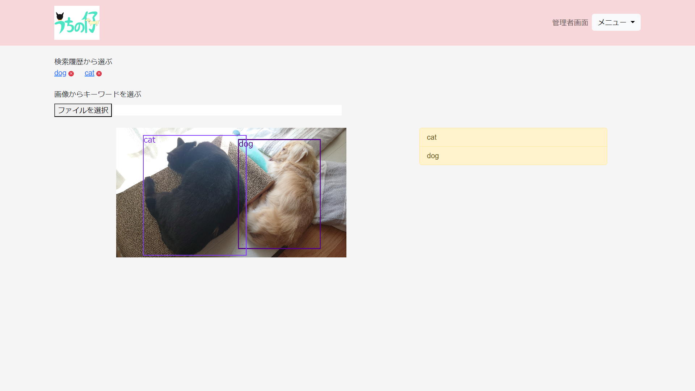

# うちの仔

## 概要
PythonのフレームワークのDjangoを主に使用して作りました。

学習済みデータセットモデルを使用して、指定したクラスがある画像ファイルの検出をローカルフォルダ内から行います。

検出された画像ファイルは画面に表示され、好きなフォルダに移動させることができます。

| 最初の画面 |
| ----- |
|  |

| ホーム画面 | 結果 |
| ----- | ----- |
|  |  |

| 指定クラスの画像検索画面 | 結果 |
| ----- | ----- |
|  |  |

## 使用技術
- Python 3.12.4
- Django 5.0.6
- ultralytics 8.2.27
- django-bootstrap5 24.2
- MySQL 8.0.31
- jQuery 3.7.1
- paginathing.js

## ライセンス
[AGPL-3.0 License](LICENSE)
